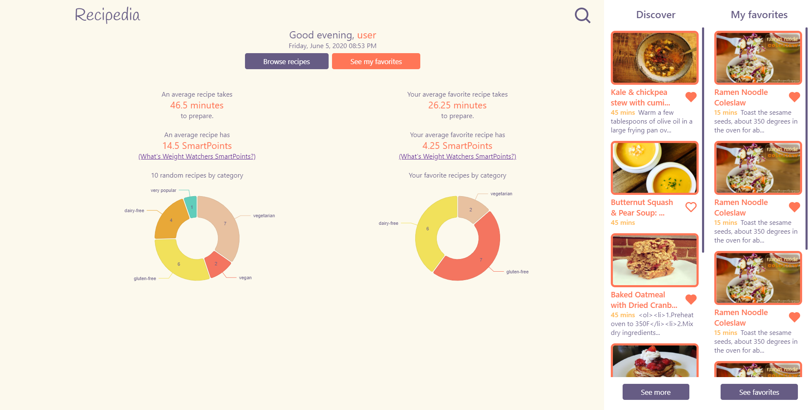
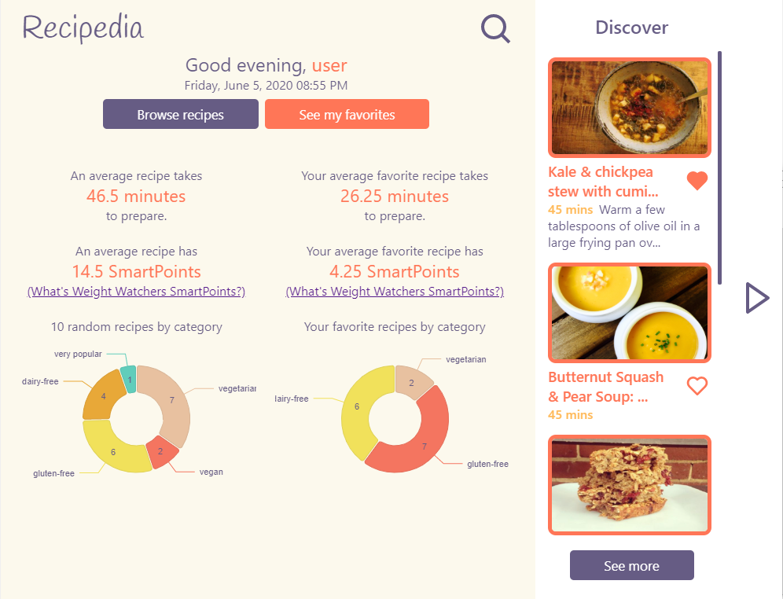
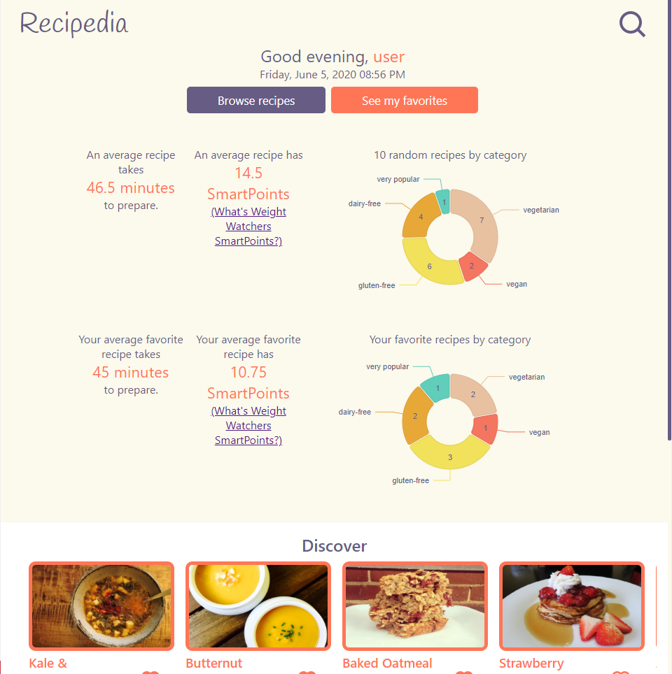
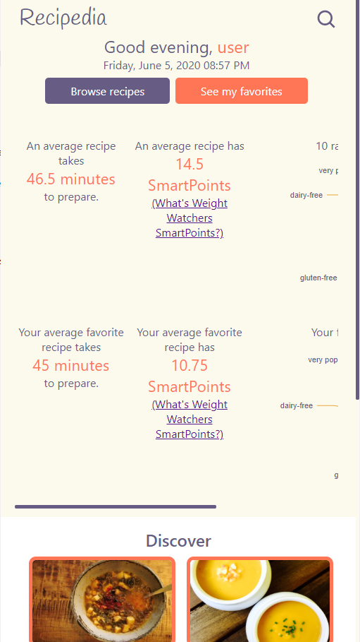

# Recipedia

Recipe dashboard for CS Front-end web techs, done in React JS.

Packages:
- [styled-components](https://styled-components.com/)
- [gh-pages](https://github.com/gitname/react-gh-pages)
- [nivo](https://nivo.rocks/) (charting library)

## Screenshots
Desktop

Laptop

Tablet

Mobile

